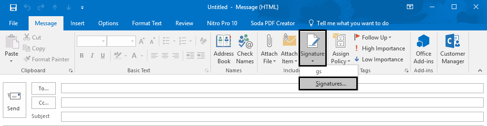
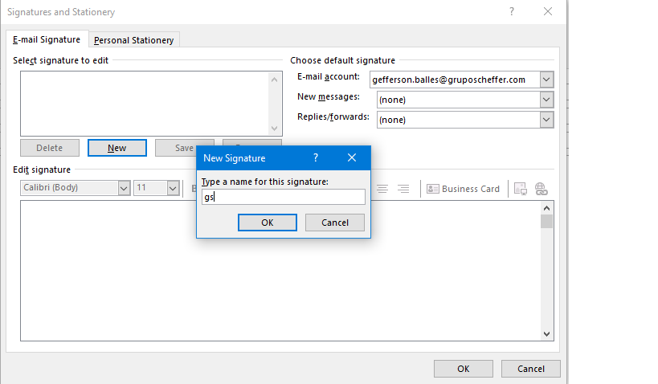
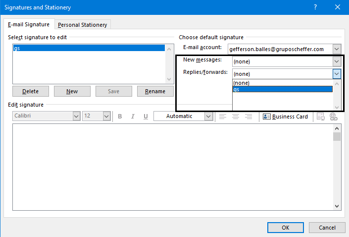
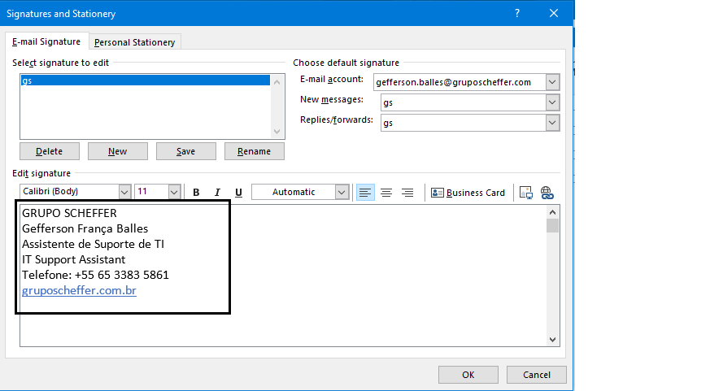
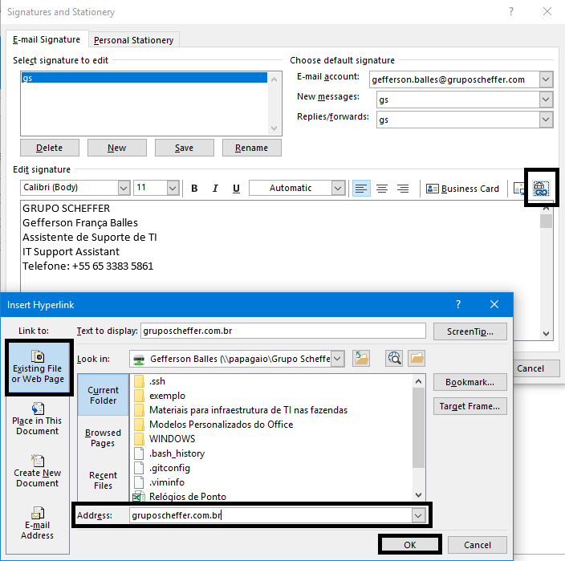
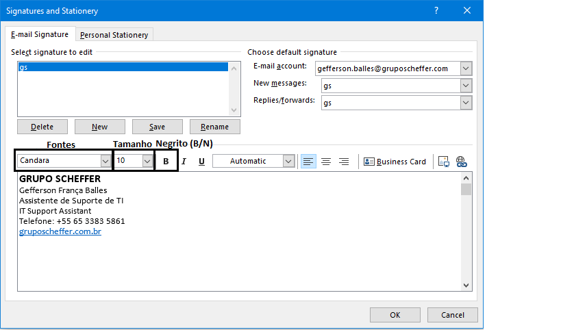
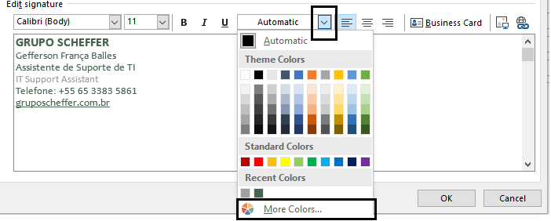
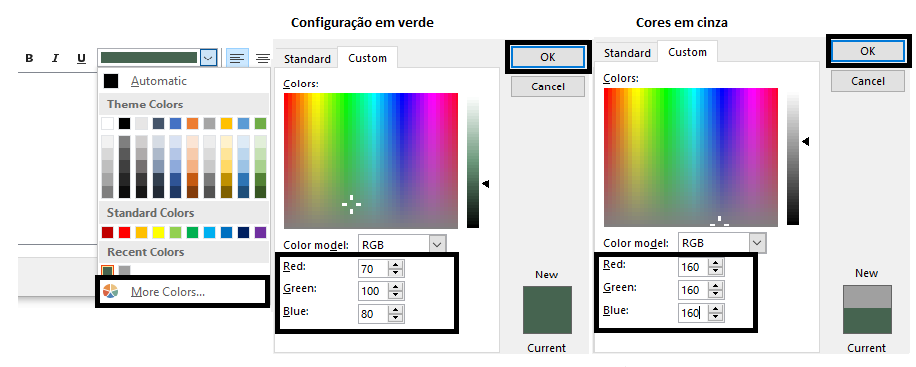
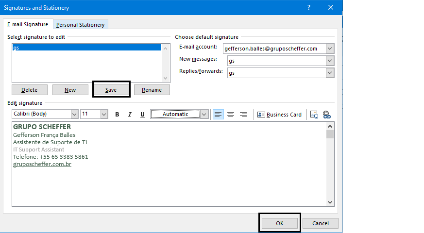

# **Configurando assinatura de E-mail**

### Acessando página de assinaturas

* Em `Home/Página inicial` clica em `Novo Email/NewEmail`.

* Na nova janela clica em `Signature/Assinaturas`.

* Na nova tela em `New/Novo`, adicionar um nome a assinatura e clica em `Ok`.

* Depois em `New messages/Novas mensagens` e `Replies/forwards|Respostas/Encaminhamentos` selecione `gs`.

* Insira o corpo da assinatura com o **nome** do Grupo em *maiúsculo*, **nome próprio**, **cargo** em *Português* e *Inglês*, seguido os *números dos telefones* (**ramais** *e* **telefone celular**), e por último o **Hiperlink "gruposcheffer.com.br"**.

Ps: Segundo orientação do **Setor Jurídico, é vedado o uso de números de telefones particulares nas assinaturas**, exceto números corporativos. Caso não tenha um número corporativo, apagar campo *Celular*

* Para gerar o *Hiperlink*, é preciso clicar no ícone *Hiperlink*, no campo `Address/Endereço` digite o site **"gruposcheffer.com.br"**, e por fim clicar em `Ok`.

* Instruções para configuração de Fontes e Cores.

1 -	Nome da empresa em verde, Fonte Calibri 12 pt em Negrito.  
2 -	Nome e cargo (em Português) em verde, Fonte Candara 10 pt.  
3 -	Cargo (em inglês) em cinza, Fonte Calibri 10 pt.  
4 -	Telefones para contato em verde, Fonte Calibri 10 pt.  
5 -	Site em verde, Fonte Candara 10 pt (com hiperlink).  
Observação importante: procure no seu programa de e-mail a escala de cores RGB para alterar as cores das fontes. Em verde: R 70, G 100, B 80 e em cinza: R 160, G 160, B 160. 

* Para alterar as Fontes e cores da Assinatura basta selecionar o texto que deseja alterar, como na imagem abaixo, procure as fontes e o tamanho das fontes conforme orientação acima.

* Para alterar as cores das fontes é preciso selecionar o texto e como na imagem abaixo, clicar na seta do seguinte campo, clicar em `More colors.../Mais cores` e em `Custom/Personalizar`. Como descrito na instrução acima, o texto em verde deve ficar com a seguinte configuração.

* Por fim, clique em `Save/Salvar` para salvar a assinatura e em `Ok` para finalizar a configuração da Assinatura. 

