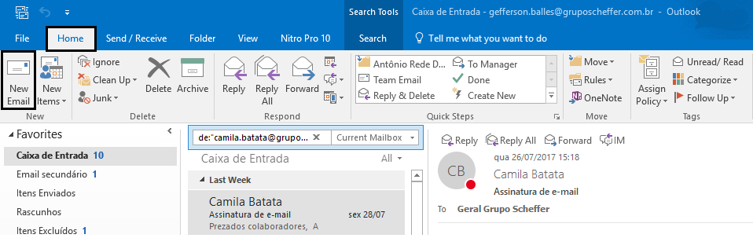
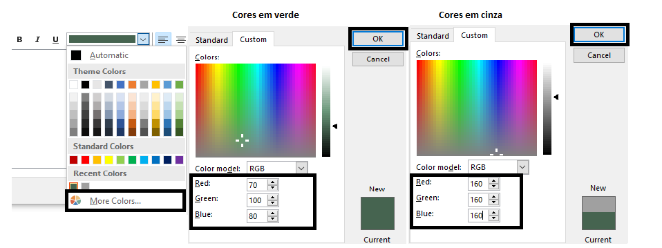

# **Configurando assinatura de E-mail**

### Acessando página de assinaturas

Em ***Home/Página inicial*** clica em ***New Email/Novo Email***.

Na nova janela clica em ***Signature/Assinaturas***.

### Criando assinatura

Na tela *Assinaturas e Papel de Carta* clique em ***New/Novo***, adicione um nome à nova assinatura e clica em ***Ok***.

Depois, em ***New messages/Novas mensagens*** e ***Replies/forwards e Respostas/Encaminhamentos*** selecione ***gs***.

### Corpo da Assinatura

Insira o corpo da assinatura com o ***nome*** do Grupo em ***maiúsculo***, ***nome próprio***, ***cargo*** em ***Português e Inglês***, seguido dos ***números dos telefones*** (***ramais*** *e* ***telefone celular***), e por último o ***Hiperlink "gruposcheffer.com.br"***.

* **Ps: Segundo orientação do Setor Jurídico, é vedado o uso de números de telefones particulares nas assinaturas, exceto números corporativos. Caso não tenha um número corporativo, apagar campo *Celular***.

*Segue exemplo abaixo*.  

### Gerando Hiperlink

Para gerar o ***Hiperlink***, é preciso clicar no ícone ***Hiperlink***, no campo ***Address/Endereço*** digite o site **"gruposcheffer.com.br"**, e por fim clicar em ***Ok***.

 

### Instruções para configuração de Fontes e Cores.

1 -	Nome da empresa em verde, Fonte Calibri 12 pt em Negrito.  
2 -	Nome e cargo (em Português) em verde, Fonte Candara 10 pt.  
3 -	Cargo (em inglês) em cinza, Fonte Calibri 10 pt.  
4 -	Telefones para contato em verde, Fonte Calibri 10 pt.  
5 -	Site em verde, Fonte Candara 10 pt (com hiperlink).  
Observação importante: procure no seu programa de e-mail a escala de cores RGB para alterar as cores das fontes. Em verde: V 70, V 100, A 80 e em cinza: V 160, V 160, A 160. 

### Alterando Fontes

Para alterar as Fontes e cores da Assinatura basta selecionar o texto que deseja alterar, como na imagem abaixo, procure as fontes e o tamanho das fontes conforme descrito em ***Instruções para configuração de Fontes e Cores***.

### Alterando Cores

Para alterar as cores das fontes é preciso selecionar o texto como na imagem abaixo, clicar na seta do campo *Cores*, clicar em ***More colors.../Mais cores*** e em ***Custom/Personalizar***. Como descrito nas ***Instruções para configuração de Fontes e Cores***, o texto em verde deve ficar com as seguintes configurações.

Por fim, clique em ***Save/Salvar*** para salvar a assinatura e em ***Ok*** para finalizar a configuração da Assinatura. 

